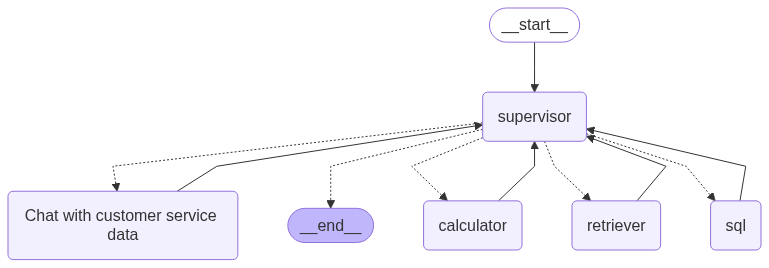

# Building Multi-agent Systems with Databricks
**Objective:** Build a customer service agent system to handle customer requests and do product Q&A.

## Part 1: Create tools
#### [1.1 Create SQL Functions and register as UC Functions]($./01_create_tools/1.1_create_sql_fn)
- Create specific queries that access data critical to steps in the customer service workflow for processing a return. 
- Register as Unity Catalog functions for governance and discoverabiliy

#### [1.2 Create AI/BI Genie]($./01_create_tools/1.2_create_genie_space)
- Chat with your structured tables using natural language. AI/BI Genie adds a LLM to your tables so it can do Text-to-SQL to generate appropriate queries to answer your questions. 
- Optionally register this retriever tool as a UC function.

#### [1.3 Create a retriever tool]($./01_create_tools/1.3_create_retriever)
- Add unstructured product documentation in a Vector Store (already indexed in [0_setup]($./01_create_tools/0_setup)). 
- Optionally register this retriever tool as a UC function.

#### 1.4 Prototype the tools in AI Playground
Use the AI Playground to bring together your UC functions tools.

--------
## Part 2: Create multi-agent system
There are three notebooks in Part 2 to create your agent system in LangGraph. It involves a supervisor agent that decides which other 4 ReAct agents (SQL, Genie, Retriever and python tool created in Part 1) to assign tasks. 
1. [agent]($./02_agent/agent): contains the code to build the agent (only the code in mlflow.models.set_model will be served)
2. [driver]($./02_agent/driver): references the agent code then logs, registers, evaluates and deploys the agent.
3. [config.yml]($./02_agent/config.yml): contains the configuration settings.
#### 2.1 Define the agent code in the [agent NB]($./02_agent/agent) and the config in [config.yml]($./02_agent/config.yml)

#### 2.2 Evaluate, Deploy and Monitor Agent [driver NB]($./02_agent/driver)
- Log the agent using mlflow.langchain.log_model
- Evaluate with LLM judges on curated and synthetic evaluation sets
- Deploy agent to Model Serving
- Test agent app
- Optionally test agent app locally
- Collect human feedback with Review App
- Lakehouse monitoring of agent app

## Next Steps
- **Explore More Tools**: Extend your agent with APIs, advanced Python functions, or additional SQL endpoints.  
- **Production Deployment**: Integrate CI/CD for continuous improvement, monitor performance in MLflow, and manage model versions.

---

Congratulations on building and evaluating your agent system in Databricks!
